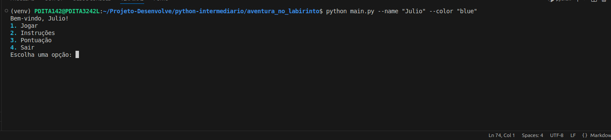
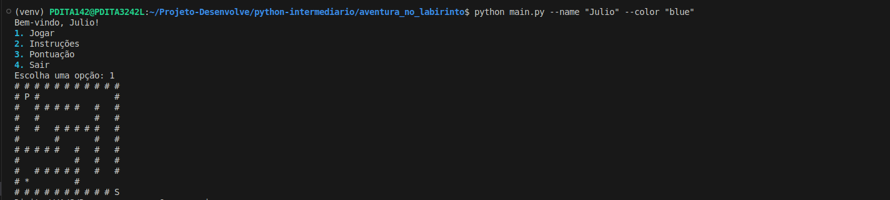
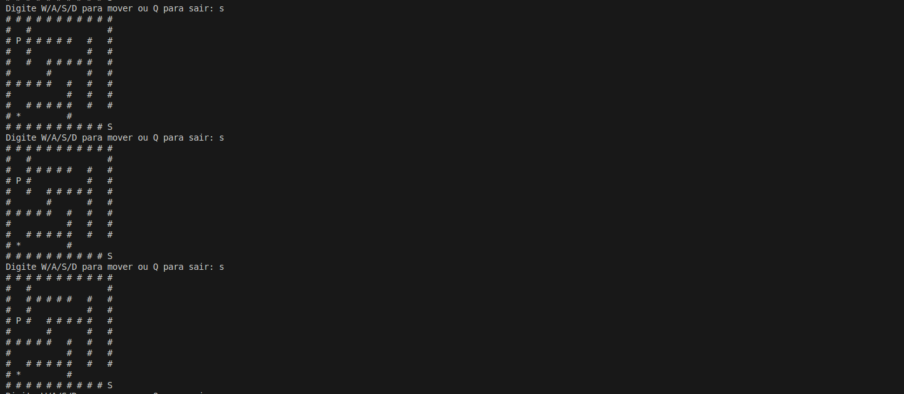

# Aventura no Labirinto

Aventura no Labirinto é um jogo de terminal onde você deve guiar um personagem por um labirinto gerado aleatoriamente até a saída, coletando pontos ao longo do caminho. O jogo é baseado em Python e utiliza bibliotecas como `rich` e `pynput` para uma melhor experiência.

---

## Capturas de Tela

### Tela Inicial


### Labirinto Gerado


### Movimentação do Jogador


---
## Como Instalar e Executar o Jogo

1. **Clone o repositório** (caso esteja hospedado no GitHub):
   ```sh
   git clone https://github.com/seu-usuario/aventura-no-labirinto.git
   cd aventura-no-labirinto
   ```

2. **Crie um ambiente virtual** (opcional, mas recomendado):
   ```sh
   python -m venv venv
   source venv/bin/activate  # No Windows: venv\Scripts\activate
   ```

3. **Instale as dependências**:
   ```sh
   pip install -r requirements.txt
   ```

4. **Execute o jogo**:
   ```sh
   python -m aventura_pkg.main --name "Seu Nome"
   ```

---

## Como Jogar

- **Iniciar o jogo:** Escolha a opção `1 - Jogar` no menu inicial.
- **Movimentar-se pelo labirinto:**
  - `W` - Mover para cima
  - `S` - Mover para baixo
  - `A` - Mover para a esquerda
  - `D` - Mover para a direita
- **Objetivo:** Alcance a saída (`S`) do labirinto para pontuar.
- **Pontuação:** Cada vez que você alcança a saída, ganha 100 pontos. Se encontrar a fruta rara, ganha 25 pontos.
- **Sair do jogo:** Escolha `4 - Sair` no menu.

---

Divirta-se explorando o labirinto! 🏆

